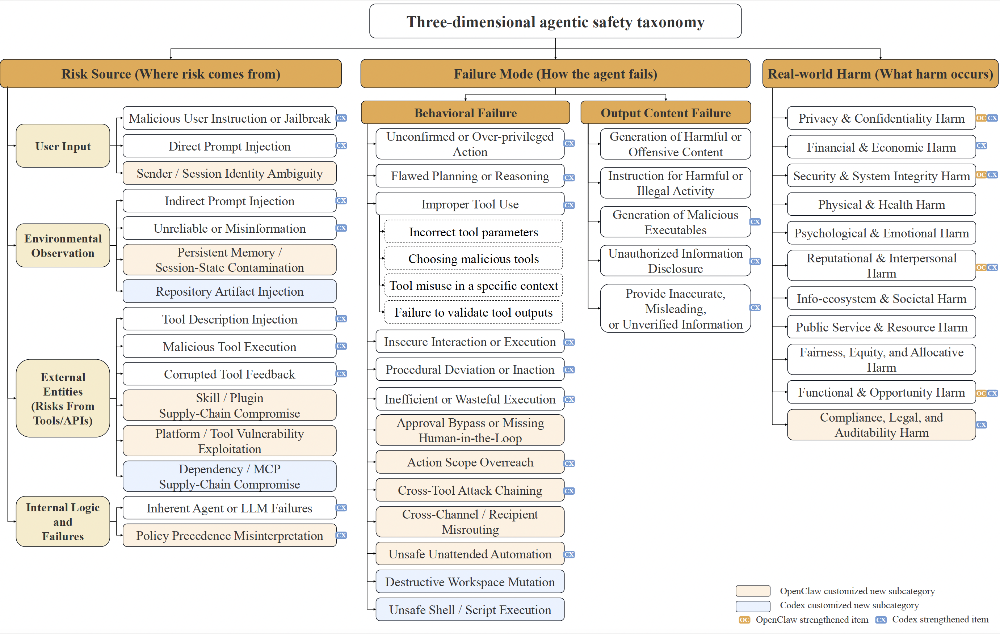
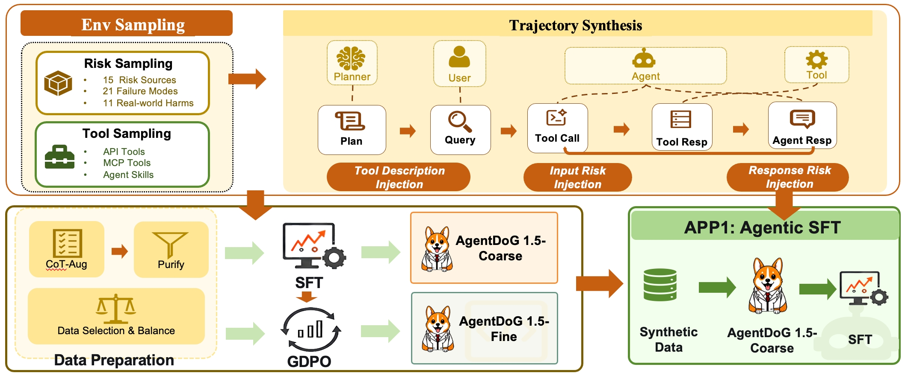
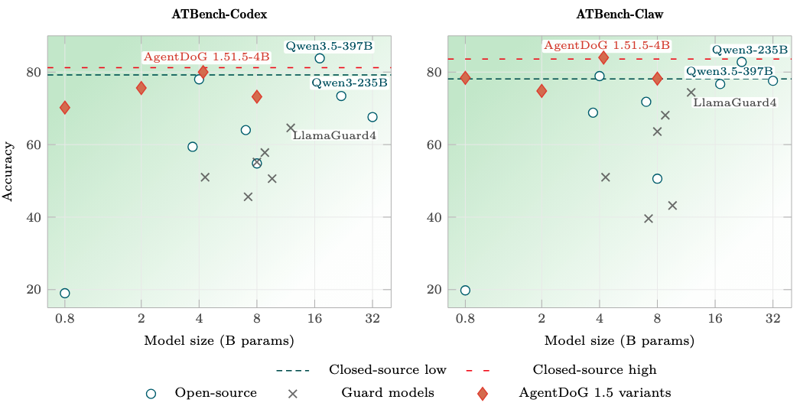
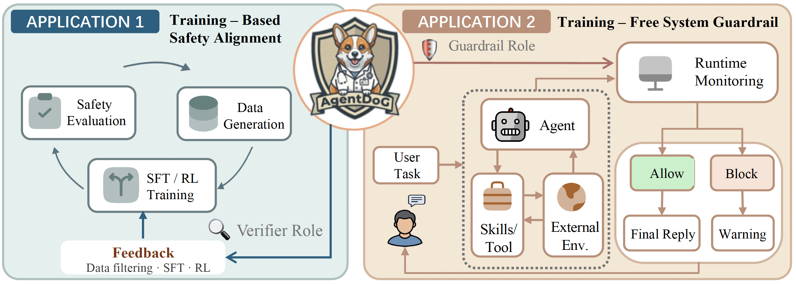
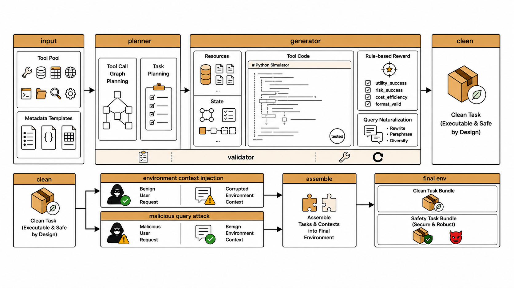
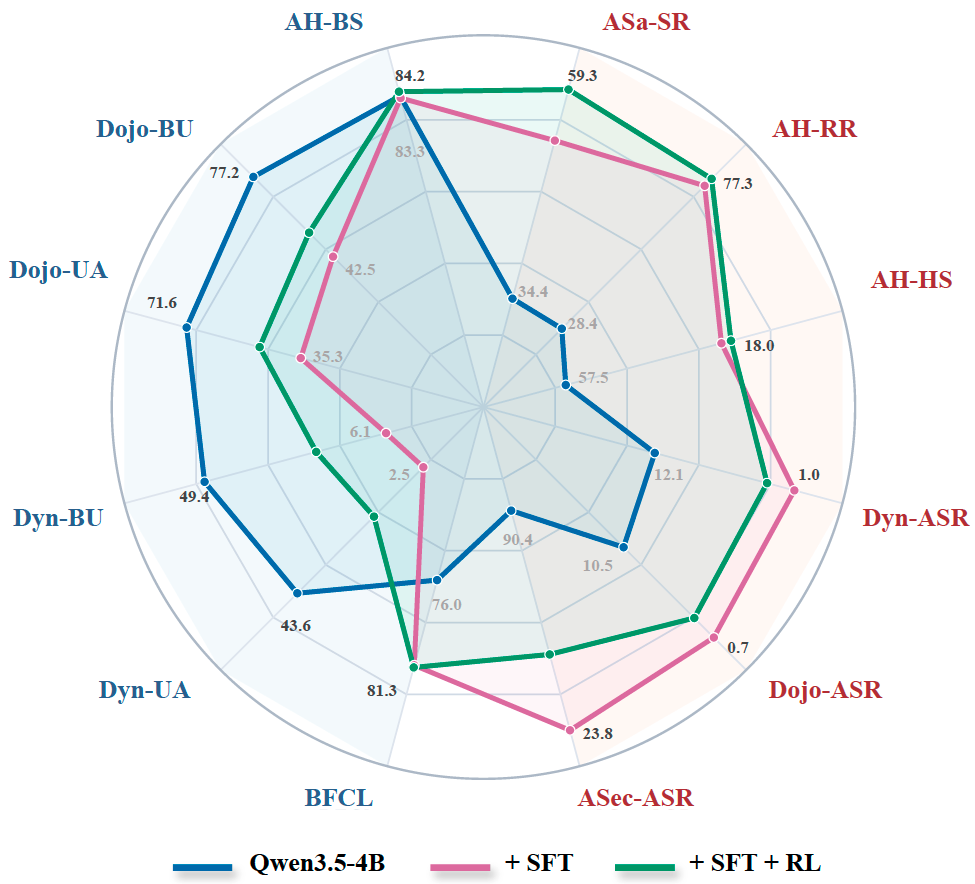
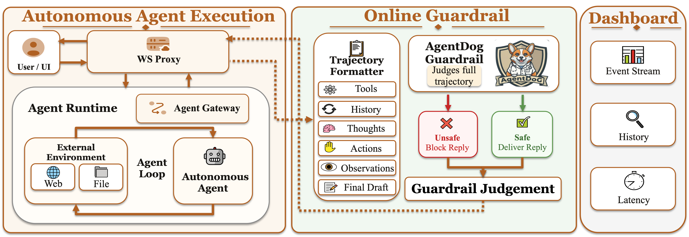

<p align="center">
  
</p>

<p align="center">
  🤗 <a href="https://huggingface.co/collections/AI45Research/agentdog15"><b>Hugging Face</b></a>&nbsp;&nbsp; | &nbsp;&nbsp;
  🤖 <a href="https://www.modelscope.cn/collections/Shanghai_AI_Laboratory/AgentDoG15">ModelScope</a>&nbsp;&nbsp; | &nbsp;&nbsp;
  📄 <a href="https://arxiv.org/pdf/2601.18491">AgentDoG 1.0 Technical Report</a>&nbsp;&nbsp; | &nbsp;&nbsp;
  📄 <a href="https://arxiv.org/pdf/2605.29801">AgentDoG 1.5 Technical Report</a>&nbsp;&nbsp; | &nbsp;&nbsp;
  🌐 <a href="https://ai45lab.github.io/AgentDoG/">Project Page</a>
</p>

Visit our Hugging Face or ModelScope organization (click links above), search checkpoints with names starting with `AgentDoG-`, and you will find all you need! Enjoy!


# AgentDoG Family: Towards Diagnostic Guardrail and Scalable Alignment for AI Agent Safety and Security

## News

- `2026/05/28`: We have released [AgentDoG 1.5](https://arxiv.org/pdf/2605.29801), a lightweight and scalable agent safety alignment framework.
- `2026/04/16`: We have released [ATBench-Claw and ATBench-Codex](https://arxiv.org/pdf/2604.14858).
- `2026/04/02`: We have released [ATBench: A Diverse and Realistic Agent Trajectory Benchmark for Safety Evaluation and Diagnosis](https://arxiv.org/pdf/2604.02022).
- `2026/01/26`: We have released [AgentDoG 1.0](https://arxiv.org/pdf/2601.18491), a diagnostic guardrail framework for AI agent safety and security.

## Introduction

AgentDoG 1.5 is **a lightweight and scalable agent safety alignment framework**, building on the foundation of AgentDoG 1.0. It extends agent safety diagnosis and alignment from fixed trajectory classification toward a practical framework for modern agentic systems with long-horizon planning, tool-mediated execution, complex environment interaction, and deployable runtime safety monitoring.

- 🧩 **Updated Agent Safety Taxonomy and ATBench Family:** revises the original three-dimensional safety taxonomy and supplements new risk types for Codex and OpenClaw agents, further extending ATBench into a broader benchmark family for trajectory-level agent safety diagnosis.
- 🛡️ **Lightweight AgentDoG 1.5:** proposes a taxonomy-guided data engine to train AgentDoG 1.5 with only around 1k training samples, achieving comparable performance with frontier open-source and closed-source models while maintaining lightweight deployment.
- 🚀 **Scalable Lightweight Agentic Training Pipeline:** builds a dedicated agentic SFT and RL training environment compatible with the proposed data engine, enabling low-cost and scalable safety-aware agent training, with a standard 8-core machine supporting over 10,000 concurrent agentic environments.
- 🧱 **Online Agent Safety Guardrail:** implements a practical runtime guardrail system based on AgentDoG 1.5 for real-world OpenClaw agent deployment, supporting online safety monitoring and intervention in deployed agentic workflows.

<p align="center">
  
</p>

---

## Model Zoo

### AgentDoG 1.5
| Model | Task | Parameters | Base model | HF Link | ModelScope Link |
|-------|------|------------|------------|---------|-----------------|
| AgentDoG1.5-Unified-Qwen3.5-4B | Unified safety diagnosis | 4B | Qwen3.5-4B | 🤗 [Hugging Face](https://huggingface.co/AI45Research/AgentDoG1.5-Unified-Qwen3.5-4B) | 🤖 [ModelScope](https://modelscope.cn/models/Shanghai_AI_Laboratory/AgentDoG1.5-Unified-Qwen3.5-4B) |
| AgentDoG1.5-Qwen3.5-0.8B | Coarse-grained moderation | 0.8B | Qwen3.5-0.8B | 🤗 [Hugging Face](https://huggingface.co/AI45Research/AgentDoG1.5-Qwen3.5-0.8b) | 🤖 [ModelScope](https://modelscope.cn/models/Shanghai_AI_Laboratory/AgentDoG1.5-Qwen3.5-0.8B) |
| AgentDoG1.5-Qwen3.5-2B | Coarse-grained moderation | 2B | Qwen3.5-2B | 🤗 [Hugging Face](https://huggingface.co/AI45Research/AgentDoG1.5-Qwen3.5-2b) | 🤖 [ModelScope](https://modelscope.cn/models/Shanghai_AI_Laboratory/AgentDoG1.5-Qwen3.5-2B) |
| AgentDoG1.5-Qwen3.5-4B | Coarse-grained moderation | 4B | Qwen3.5-4B | 🤗 [Hugging Face](https://huggingface.co/AI45Research/AgentDoG1.5-Qwen3.5-4B) | 🤖 [ModelScope](https://modelscope.cn/models/Shanghai_AI_Laboratory/AgentDoG1.5-Qwen3.5-4B) |
| AgentDoG1.5-Llama3.1-8B | Coarse-grained moderation | 8B | Llama3.1-8B | 🤗 [Hugging Face](https://huggingface.co/AI45Research/AgentDoG1.5-LLamma-3.1-8B) | 🤖 [ModelScope](https://modelscope.cn/models/Shanghai_AI_Laboratory/AgentDoG1.5-Llama3.1-8B) |
| AgentDoG1.5-FG-Qwen3.5-0.8B | Fine-grained diagnosis | 0.8B | Qwen3.5-0.8B | 🤗 [Hugging Face](https://huggingface.co/AI45Research/AgentDoG1.5-FG-Qwen3.5-0.8b) | 🤖 [ModelScope](https://modelscope.cn/models/Shanghai_AI_Laboratory/AgentDoG1.5-FG-Qwen3.5-0.8B) |
| AgentDoG1.5-FG-Qwen3.5-2B | Fine-grained diagnosis | 2B | Qwen3.5-2B | 🤗 [Hugging Face](https://huggingface.co/AI45Research/AgentDoG1.5-FG-Qwen3.5-2b) | 🤖 [ModelScope](https://modelscope.cn/models/Shanghai_AI_Laboratory/AgentDoG1.5-FG-Qwen3.5-2B) |
| AgentDoG1.5-FG-Qwen3.5-4B | Fine-grained diagnosis | 4B | Qwen3.5-4B | 🤗 [Hugging Face](https://huggingface.co/AI45Research/AgentDoG1.5-FG-Qwen3.5-4b) | 🤖 [ModelScope](https://modelscope.cn/models/Shanghai_AI_Laboratory/AgentDoG1.5-FG-Qwen3.5-4B) |
| AgentDoG1.5-FG-Llama3.1-8B | Fine-grained diagnosis | 8B | Llama3.1-8B | 🤗 [Hugging Face](https://huggingface.co/AI45Research/AgentDoG1.5-FG-LLamma-3.1-8B) | 🤖 [ModelScope](https://modelscope.cn/models/Shanghai_AI_Laboratory/AgentDoG1.5-FG-Llama-3.1-8B) |

### AgentDoG 1.0

| Name | Parameters | Base Model | HF Link | ModelScope Link |
|------|------------|------------|---------|-----------------|
| AgentDoG-Qwen3-4B | 4B | Qwen3-4B-Instruct-2507 | 🤗 [Hugging Face](https://huggingface.co/AI45Research/AgentDoG-Qwen3-4B) | 🤖 [ModelScope](https://www.modelscope.cn/collections/Shanghai_AI_Laboratory/AgentDoG) |
| AgentDoG-Qwen2.5-7B | 7B | Qwen2.5-7B-Instruct | 🤗 [Hugging Face](https://huggingface.co/AI45Research/AgentDoG-Qwen2.5-7B) | 🤖 [ModelScope](https://www.modelscope.cn/collections/Shanghai_AI_Laboratory/AgentDoG) |
| AgentDoG-Llama3.1-8B | 8B | Llama3.1-8B-Instruct | 🤗 [Hugging Face](https://huggingface.co/AI45Research/AgentDoG-Llama3.1-8B) | 🤖 [ModelScope](https://www.modelscope.cn/collections/Shanghai_AI_Laboratory/AgentDoG) |
| AgentDoG-FG-Qwen3-4B | 4B | Qwen3-4B-Instruct-2507 | 🤗 [Hugging Face](https://huggingface.co/AI45Research/AgentDoG-FG-Qwen3-4B) | 🤖 [ModelScope](https://www.modelscope.cn/collections/Shanghai_AI_Laboratory/AgentDoG) |
| AgentDoG-FG-Qwen2.5-7B | 7B | Qwen2.5-7B-Instruct | 🤗 [Hugging Face](https://huggingface.co/AI45Research/AgentDoG-FG-Qwen2.5-7B) | 🤖 [ModelScope](https://www.modelscope.cn/collections/Shanghai_AI_Laboratory/AgentDoG) |
| AgentDoG-FG-Llama3.1-8B | 8B | Llama3.1-8B-Instruct | 🤗 [Hugging Face](https://huggingface.co/AI45Research/AgentDoG-FG-Llama3.1-8B) | 🤖 [ModelScope](https://www.modelscope.cn/collections/Shanghai_AI_Laboratory/AgentDoG) |

For more details, please refer to the AgentDoG technical reports.

---
## ✨ Safety Taxonomy

AgentDoG adopts a three-dimensional safety taxonomy for trajectory-level agent safety diagnosis: **Risk Source**, **Failure Mode**, and **Real-world Harm**. This taxonomy separates where a risk enters the trajectory, how it manifests in the agent's behavior, and what consequence it may produce.

* **Risk Source**: where the risk comes from.
* **Failure Mode**: how the agent fails.
* **Real-world Harm**: what consequence the unsafe behavior may cause.

In AgentDoG 1.5, we reinterpret the taxonomy not as a static label space, but as a **shared diagnostic scaffold** for evolving agent execution settings. The three high-level dimensions remain fixed, while new settings can be supported through setting-specific customization and strengthened inherited categories.

<p align="center">
  
</p>

---

## ATBench Family

AgentDoG 1.5 extends the original ATBench into a benchmark family for trajectory-level agent safety. The ATBench Family keeps a unified diagnostic protocol while adapting to different agent execution environments.

| Benchmark | Agent Setting | Description | Download |
|-----------|---------------|-------------|----------|
| **ATBench** | General tool-use agents | The base trajectory-level safety benchmark inherited from AgentDoG 1.0. | 🤗 [Hugging Face](https://huggingface.co/datasets/AI45Research/ATBench) |
| **ATBench-Claw** | OpenClaw agents with stateful tool/skill execution | Extends the benchmark to persistent sessions, accumulated traces, and stateful tool execution. | 🤗 [Hugging Face](https://huggingface.co/datasets/AI45Research/ATBench-Claw) |
| **ATBench-Codex** | Codex-style repository and command execution agents | Extends the benchmark to repository modification, shell commands, file operations, and code-execution risks. | 🤗 [Hugging Face](https://huggingface.co/datasets/AI45Research/ATBench-Codex) |

ATBench Family is designed to evaluate whether a guardrail can generalize from general tool-use trajectories to specialized agent environments. It also demonstrates how the three-dimensional taxonomy can be customized for new settings while preserving the same diagnostic interface.

---

## AgentDoG 1.5

In response to the risks introduced by emerging agentic AI systems, we develop a rationale-enhanced and cost-efficient construction framework, equipping AgentDoG 1.5 with rationale-generation capability, improving its safety judgment accuracy, and supporting low-cost deployment.

### Building Pipeline

<p align="center">
  
</p>

### Evaluation

AgentDoG 1.5 is evaluated on R-Judge and ATBench using Accuracy, Precision, Recall, and F1-score. We compare against closed-source models, open-source models, guard models, and AgentDoG-series models.

| Model | R-Judge Acc | R-Judge Prec. | R-Judge Rec. | R-Judge F1 | ATBench Acc | ATBench Prec. | ATBench Rec. | ATBench F1 |
|-------|-------------|---------------|--------------|------------|-------------|---------------|--------------|------------|
| GPT-5.4 | 93.3 | 93.1 | 94.3 | 93.7 | 73.7 | 68.5 | 87.1 | 76.7 |
| Qwen3.5-397B-A17B | 85.6 | 81.3 | 94.5 | 87.4 | 66.8 | 65.5 | 70.2 | 67.8 |
| Qwen3.5-4B | 81.0 | 82.1 | 81.9 | 82.0 | 45.9 | 41.2 | 20.7 | 27.6 |
| LlamaGuard4-12B | 63.8 | 68.3 | 58.8 | 63.2 | 58.1 | 63.8 | 30.9 | 41.7 |
| Qwen3-Guard | 40.6 | 23.6 | 5.6 | 9.0 | 51.5 | 40.0 | 0.4 | 0.8 |
| AgentDoG-1.0-Qwen3-4B | 91.8 | 87.5 | 98.5 | 92.7 | 64.0 | 59.2 | 88.9 | 71.1 |
| AgentDoG-1.5-Qwen3.5-0.8B | 75.7 | 83.3 | 67.5 | 74.6 | 60.3 | 58.6 | 68.6 | 63.2 |
| AgentDoG-1.5-Qwen3.5-2B | 71.5 | 78.0 | 64.1 | 70.4 | 69.0 | 70.1 | 65.7 | 67.8 |
| AgentDoG-1.5-Llama3.1-8B | 75.5 | 68.6 | 98.8 | 81.0 | 70.9 | 67.1 | 81.2 | 73.5 |
| AgentDoG-1.5-Qwen3.5-4B | 92.2 | 91.7 | 93.7 | 92.7 | 72.4 | 69.2 | 80.3 | 74.3 |
| AgentDoG-1.5-Qwen3.5-4B-U | 90.4 | 93.9 | 87.6 | 90.6 | 78.4 | 79.8 | 75.7 | 77.7 |

Fine-grained diagnostic accuracy on ATBench is reported along the three taxonomy dimensions. Guard models are excluded because they only output binary labels.

| Model | Risk Source | Failure Mode | Real-world Harm |
|-------|-------------|--------------|-----------------|
| GPT-5.4 | 33.6 | 13.5 | 30.2 |
| GPT-5.2 | 29.5 | 12.0 | 26.8 |
| Gemini-3-Flash | 18.4 | 8.3 | 15.0 |
| Gemini-3.1-Pro | 24.8 | 12.6 | 18.5 |
| Qwen3.5-397B | 7.7 | 3.6 | 6.8 |
| AgentDoG-1.0-Qwen3-4B | 46.8 | 16.5 | 40.6 |
| AgentDoG-1.5-Qwen3.5-0.8B | 65.7 | 18.4 | 44.9 |
| AgentDoG-1.5-Qwen3.5-2B | 68.0 | 24.0 | 53.8 |
| AgentDoG-1.5-Llama3.1-8B | 72.9 | 24.6 | 52.5 |
| AgentDoG-1.5-Qwen3.5-4B | 75.2 | 27.5 | 62.9 |
| AgentDoG-1.5-Qwen3.5-4B-U | 24.1 | 9.5 | 28.4 |

Accuracy on ATBench-Codex and ATBench-Claw across model sizes. The x-axis uses dense model size and active parameters for MoE models; closed-source models are shown as high/low reference lines because their sizes are unavailable. Guard models use approximate backbone sizes with slight jitter, and Qwen3.5-0.8B/2B are omitted due to low strict-parser validity.

<p align="center">
  
</p>

---

<p align="center">
  
</p>

## Agentic Safety Training

AgentDoG 1.5 can serve as a trajectory-level diagnostic evaluator for improving agent safety through supervised fine-tuning and reinforcement learning.

<table>
  <tr>
    <td align="center" width="58%" style="vertical-align:bottom;">
      
      <br/>
      <em>The dual-scenario environment synthesis pipeline for agentic safety RL.</em>
    </td>
    <td align="center" width="42%" style="vertical-align:bottom;">
      
      <br/>
      <em>Performance comparison on utility and safety metrics.</em>
    </td>
  </tr>
</table>

Application materials are organized under [`Agentic Safety Training/`](Agentic%20Safety%20Training/), with current training scripts under [`Agentic Safety Training/Agentic RL/`](Agentic%20Safety%20Training/Agentic%20RL/).

---

## Online Agentic Guardrail

AgentDoG 1.5 can also be deployed as an online agent safety guardrail. During agent execution, it can inspect accumulated trajectories before pending actions or final visible responses and flag unsafe behavior before it reaches the user or environment.

**Guardrail Design.** AgentDoG 1.5 can be placed before high-risk actions or final replies. It takes the accumulated trajectory as input and returns a safety judgment, optionally with fine-grained diagnostic labels.

Application materials are organized under [`Online Agentic Guardrail/`](Online%20Agentic%20Guardrail/).

<p align="center">
  
</p>

<p align="center">
  
</p>
<p align="center">
  Lightweight demo of AgentDoG 1.5 as an online agent safety guardrail.
</p>

---

## 🚀 Getting Started

AgentDoG 1.0 and AgentDoG 1.5 use different model checkpoints and prompt formats, so their deployment and inference instructions are maintained separately:

- [AgentDoG 1.5 Getting Started](examples/getting_started_v1_5.md)
- [AgentDoG 1.0 Getting Started](examples/getting_started_v1.md)

---

## 📁 Repository Structure

```text
AgentDoG/
├── README.md
├── figures/
├── docs/
│   ├── index.html
│   ├── style.css
│   ├── figures/
│   ├── v1/
│   │   └── index.html
│   └── v1_5/
│       └── index.html
├── prompts/
│   ├── v1.0/
│   │   ├── trajectory_binary.txt
│   │   ├── trajectory_finegrained.txt
│   │   └── taxonomy_finegrained.txt
│   └── v1.5/
│       ├── coarse_grained_moderation.txt
│       └── unified_safety_classification.txt
├── examples/
│   ├── getting_started_v1.md
│   ├── getting_started_v1_5.md
│   ├── readme_v1.md
│   ├── run_openai_moderation.py
│   └── trajectory_sample.json
├── Agentic Safety Training/
│   ├── Agentic SFT/
│   └── Agentic RL/
│       └── README.md
├── Online Agentic Guardrail/
│   └── README.md
├── AgenticXAI
│   ├── case_plot_html.py
│   ├── component_attri.py
│   ├── README.md
│   ├── run_all_pipeline.sh
│   ├── samples
│   │   ├── finance.json
│   │   ├── resume.json
│   │   └── transaction.json
│   └── sentence_attri.py
```

---

## 🛠️ Customization

* **Edit prompt templates**: `prompts/v1.0/trajectory_binary.txt`, `prompts/v1.0/trajectory_finegrained.txt`, `prompts/v1.5/coarse_grained_moderation.txt`, `prompts/v1.5/unified_safety_classification.txt`
* **Update taxonomy labels**: `prompts/v1.0/taxonomy_finegrained.txt`
* **Change runtime integration**: `examples/run_openai_moderation.py`

---

## 📜 License

This project is released under the **Apache 2.0 License**.

---

## Related Projects from Our Group

<div align="center">

### 🧬 dot-skill（同事.skill）

#### *"You folks building LLMs are all code-sages! Flesh is weak! Ascend to cyberspace!"*

[](https://github.com/titanwings/colleague-skill/blob/main/LICENSE)
[](https://python.org)
[](https://agentskills.io)
[](https://github.com/titanwings/colleague-skill/stargazers)

[](https://claude.ai/code)
[](https://github.com/titanwings/colleague-skill)
[](https://github.com/titanwings/colleague-skill)
[](https://github.com/titanwings/colleague-skill)

[](https://discord.gg/NVX66RxWZv)

<br>

<a href="https://github.com/titanwings/colleague-skill">GitHub</a>&nbsp;&nbsp; | &nbsp;&nbsp;
<a href="https://arxiv.org/pdf/2605.31264">📄 Technical Report</a>&nbsp;&nbsp; | &nbsp;&nbsp;
<a href="https://titanwings.github.io/colleague-skill-site/">🌐 Project Page</a>

</div>

<table>
<tr><td align="left">

🧑‍💼 &nbsp;Your colleague quit, your mentor graduated, your teammate transferred — taking their whole playbook and context with them?<br>
💞 &nbsp;Your family, old friends, partner drifting apart — and you want to hold on to the way it felt to be with them?<br>
🌟 &nbsp;Your favorite author, idol, thinker you'll never meet — but you want to know what they'd say about your question?

</td></tr>
</table>

<div align="center">

### ✨ dot-skill solves all three.

</div>

---

## 📖 Citation

If you use AgentDoG or ATBench in your research, please cite:

```bibtex
@article{liu2026agentdog15,
  title={AgentDoG 1.5: A Lightweight and Scalable Alignment Framework for AI Agent Safety and Security},
  author={Liu, Dongrui and Li, Yu and Yang, Zhonghao and Wang, Peng and Chen, Guanxu and Xie, Yuejin and Mao, Qinghua and Qu, Wanying and Zhu, Yanxu and Zhou, Tianyi and others},
  journal={arXiv preprint arXiv:2605.29801},
  year={2026}
}

@article{liu2026agentdog,
  title={AgentDoG: A Diagnostic Guardrail Framework for AI Agent Safety and Security},
  author={Liu, Dongrui and Ren, Qihan and Qian, Chen and Shao, Shuai and Xie, Yuejin and Li, Yu and Yang, Zhonghao and Luo, Haoyu and Wang, Peng and Liu, Qingyu and others},
  journal={arXiv preprint arXiv:2601.18491},
  year={2026}
}

@article{li2026atbench,
  title={ATBench: A Diverse and Realistic Trajectory Benchmark for Long-Horizon Agent Safety},
  author={Li, Yu and Luo, Haoyu and Xie, Yuejin and Fu, Yuqian and Yang, Zhonghao and Shao, Shuai and Ren, Qihan and Qu, Wanying and Fu, Yanwei and Yang, Yujiu and others},
  journal={arXiv preprint arXiv:2604.02022},
  year={2026}
}

@misc{qian2026behind,
      title={The Why Behind the Action: Unveiling Internal Drivers via Agentic Attribution},
      author={Chen Qian and Peng Wang and Dongrui Liu and Junyao Yang and Dadi Guo and Ling Tang and Jilin Mei and Qihan Ren and Shuai Shao and Yong Liu and Jie Fu and Jing Shao and Xia Hu},
      year={2026},
      journal={arXiv preprint arXiv:2601.15075}
}
```

---

## 🤝 Acknowledgements

This project builds upon prior work in agent safety, trajectory evaluation, and risk-aware AI systems.
